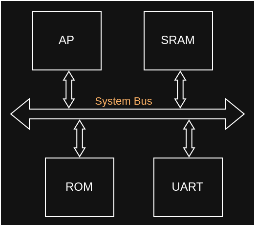

## Application Processors

An _Application Processor_ (AP) is the main processing unit of a system,
commonly designed as a _System on Chip_ (SoC). APs are sometimes also considered
microprocessors, as opposed to microcontrollers. Another regularly used term is
_Central Processing Unit_ (CPU). While design approaches and names have changed
over the years, psi-spec is concerned with the kind of processors that feature a
_Memory Management Unit_ (MMU) and DRAM, allowing for many concurrent tasks and
processing large amounts of data.

### System on Chip

An SoC integrates application processing units with [peripherals](./peripherals)
via internal system buses, all packaged into one chip. Common buses are defined
by the [AMBA](https://developer.arm.com/Architectures/AMBA) standards and the
[WISHBONE Interconnect Architecture](https://opencores.org/howto/wishbone). Some
vendors have their own designs, such as AMD's [Infinity Fabric](
https://www.amd.com/content/dam/amd/en/documents/instinct-tech-docs/other/56978.pdf).
A bus is generally a set of physical interfaces and corresponding protocols.
Parts of an SoC are called blocks.

